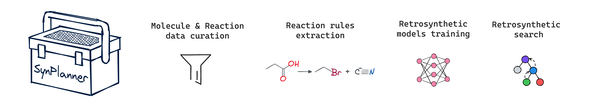

.. raw:: html

    

        <h1>SynPlanner – an end-to-end tool for synthesis planning</h1>
    

    <h3>
        

            <a href="https://synplanner.readthedocs.io/">Docs</a> •
            <a href="https://github.com/Laboratoire-de-Chemoinformatique/SynPlanner/tree/main/docs/tutorial">Tutorials</a> •
            <a href="https://doi.org/10.26434/chemrxiv-2024-bzpnd">Paper</a> •
            <a href="https://huggingface.co/spaces/Laboratoire-De-Chemoinformatique/SynPlanner">GUI demo</a>
        

    </h3>

    

        
    

``SynPlanner`` is an open-source tool for retrosynthetic planning,
designed to increase flexibility in training and developing
customized retrosynthetic planning solutions from raw chemical data.
It integrates Monte Carlo Tree Search (MCTS) with graph neural networks
to evaluate applicable reaction rules (policy network) and
the synthesizability of intermediate products (value network).

Overview
--------------------

``SynPlanner`` can be used for:

- ⚒️ Standardizing and filtering reaction data
- 📑 Extracting reaction rules (templates) with various options
- 🧠 Training policy and value networks using supervised and reinforcement learning
- 🔍 Performing retrosynthetic planning with different MCTS-based search strategies
- 🖼️ Visualising found synthetic paths and working with graphical user interface

Installation
--------------------

Conda (Linux)
====================

``SynPlanner`` can be installed using conda/mamba package managers.
For more information on conda installation please refer to the
`official documentation <https://github.com/conda-forge/miniforge>`_.

To install ``SynPlanner``, first clone the repository and move the package directory:

.. code-block:: bash

    git clone https://github.com/Laboratoire-de-Chemoinformatique/SynPlanner.git
    cd SynPlanner/

Next, create ``SynPlanner`` environment with ``synplan_env_linux.yaml`` file:

.. code-block:: bash

    conda env create -f conda/synplan_env_linux.yaml
    conda activate synplan_env
    pip install .

The installed ``SynPlanner`` environment can then be added to the Jupyter platform:

.. code-block:: bash

    python -m ipykernel install --user --name synplan_env --display-name "synplan"

Colab Tutorials
--------------------

    Colab tutorials do not require the local installation of ``SynPlanner`` but their performance is limited by available computational resources in Google Colab

Currently, two tutorials are available:

- | `General tutorial <https://colab.research.google.com/github/Laboratoire-de-Chemoinformatique/SynPlanner/blob/main/colab/general_tutorial.ipynb>`_ presents the full pipeline of SynPlanner starting from raw reaction data and resulting in ready-to-use retrosynthetic planning.
  | *This tutorial can be used for training retrosynthetic models on custom data from scratch.*
- | `Planning tutorial <https://colab.research.google.com/github/Laboratoire-de-Chemoinformatique/SynPlanner/blob/main/colab/retrosynthetic_planning.ipynb>`_ presents the ready-to-use retrosynthetic planning in SynPlanner.
  | *This tutorial can be used for retrosynthetic planning for custom target molecules with pretrained retrosynthetic models that can downloaded from SynPlanner.*

Jupyter Tutorials
--------------------

    Jupyter Tutorials requires the local installation of ``SynPlanner`` but can be executed with advanced computational resources on local servers

Currently, five tutorials are available:

**Quick-start tutorials.** These tutorials can be used for easy execution of the default ``SynPlanner`` pipeline:

- `General tutorial <https://github.com/Laboratoire-de-Chemoinformatique/SynPlanner/blob/main/docs/tutorial/general_tutorial.ipynb>`_ presents the full pipeline of SynPlanner starting from raw reaction data and resulting in ready-to-use retrosynthetic planning.

**Advanced tutorials.** These tutorials provide advanced explanations and options for each step in the ``SynPlanner`` pipeline:

- `Reaction data curation <https://github.com/Laboratoire-de-Chemoinformatique/SynPlanner/blob/main/docs/tutorial/data_curation.ipynb>`_ presents the workflow for reaction standardization and reaction filtration.
- `Reaction rules extraction <https://github.com/Laboratoire-de-Chemoinformatique/SynPlanner/blob/main/docs/tutorial/rules_extraction.ipynb>`_  provides a workflow for extracting reaction rules from curated reaction data.
- `Policy network training <https://github.com/Laboratoire-de-Chemoinformatique/SynPlanner/blob/main/docs/tutorial/ranking_policy_training.ipynb>`_ shows the workflow for policy network training.
- `Retrosynthetic planning <https://github.com/Laboratoire-de-Chemoinformatique/SynPlanner/blob/main/docs/tutorial/retrosynthetic_planning.ipynb>`_ provides an example of how to use ``SynPlanner`` for retrosynthetic planning.

SynPlanner Benchmarks
--------------------
``SynPlanner`` can be used for retrosynthetic planning of target molecules with pre-trained retrosynthetic models
and benchmarking it against other tools. This can be done easily without local ``SynPlanner`` installation with
the following Google Colab notebook:

- `Benchmarking SynPlanner <https://colab.research.google.com/github/Laboratoire-de-Chemoinformatique/SynPlanner/blob/main/colab/planning_benchmarking.ipynb>`_ running retrosynthetic  planning with SynPlanner and comparing the resulted statistics and predicted retrosynthetic routes.

Contributing
--------------------

Contributions are welcome, in the form of issues or pull requests.

If you have a question or want to report a bug, please submit an issue.

Maintainers
--------------------

* `Tagir Akhmetshin <https://github.com/tagirshin>`_
* `Dmitry Zankov <https://github.com/dzankov>`_

Contributors
--------------------

* `Timur Madzhidov <tmadzhidov@gmail.com>`_
* `Alexandre Varnek <varnek@unistra.fr>`_
* `Philippe Gantzer <https://github.com/PGantzer>`_
* `Dmitry Babadeev <https://github.com/prog420>`_
* `Anna Pinigina <anna.10081048@gmail.com>`_
* `Mikhail Volkov <https://github.com/mbvolkoff>`_

