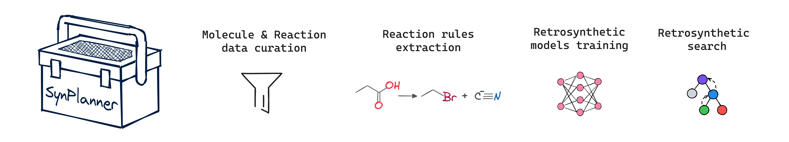
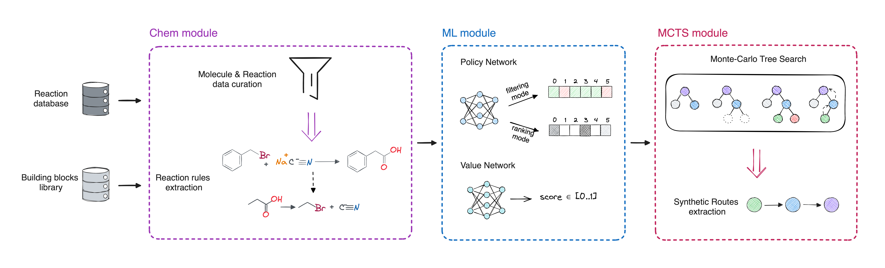

.. _index:

==========
SynPlanner
==========

``SynPlanner`` is a comprehensive tool for reaction data curation, rule extraction, retrosynthetic model training, and retrosynthetic planning.
It processes various reaction data sources to build a ready-to-use retrosynthetic planner.

``SynPlanner`` includes modules for atom-to-atom mapping, reaction curation, standardization, and rule extraction,
ensuring reproducibility from initial data to trained retrosynthetic models.

SynPlanner use cases
-----------------------

**1. Curating/cleaning reaction data**

``SynPlanner`` provides embedded enhanced reaction data curation protocols,
including reaction atom mapping, standardization, and filtering, which can be used independently.
This curated data and pipelines can be used in other reaction informatics applications or for CASP tool development.
More details can be found in `data curation`_.

**2. Extracting reaction rules from the reaction database**

``SynPlanner`` incorporates the original module for reaction rule extraction from reaction data.
The protocol of reaction rule extraction is flexible and allows balancing between the generality and specificity of reaction rules
depending on the task.
More details can be found in `reaction rules extraction`_.

**3. Building custom retrosynthetic planners**

``SynPlanner`` delivers various configurations of reaction rule extraction and a comprehensive pipeline
for preparing retrosynthetic models (policy and value networks) and building ready-to-use retro-synthetic planners.
This makes it perfect for retrosynthetic planning using custom or private re-action data, specific reaction databases,
or specific types of chemistry.

SynPlanner Pipeline
-----------------------

``SynPlanner`` includes modules for reaction data curation, reaction rules extraction, and retrosynthetic planning using the
Monte-Carlo Tree Search (MCTS) algorithm with neural networks for node expansion and evaluation.
The main steps of this pipeline are listed below.

1. **Reaction data curation** is a necessary step, including reaction strandardization and filtration.
   See the details in `data curation`_ tutorial.

2. **Reaction rules extraction** should be done from the high-quality reaction data
   prepared by the data curation steps listed above. See the details in `reaction rules extraction`_ tutorial.

3. **Policy network training** is needed for node expansion in the tree search algorithm.
   See the details in `ranking policy training`_ tutorial.

4. **Retrosynthetic planning** is done after preparing the reaction rules and training the retrosynthetic models.
   See the details in `retrosynthetic planning`_ tutorial.

.. tip::
    If you want to run retrosynthetic planning, you can download the data we used in our paper.
    See more in section :ref:`data`.

.. _retrosynthetic planning: tutorials/retrosynthetic_planning.ipynb
.. _data curation: tutorials/data_curation.ipynb
.. _reaction rules extraction: tutorials/rules_extraction.ipynb
.. _ranking policy training: tutorials/policy_training.ipynb

.. toctree::
    :hidden:
    :caption: Navigation
    :titlesonly:

    get_started/index
    user_guide/index
    api
    development
    release_notes

How to navigate this documentation
----------------------------------

- Getting started: quick install and first runs → :doc:`get_started/index`
- User Guide: tutorials and core topics (concepts, configuration, interfaces) → :doc:`user_guide/index`
- API reference: Python package API → :doc:`api`
- Development: contributing, local dev, building → :doc:`development`
- Release notes: version changes → :doc:`release_notes`

